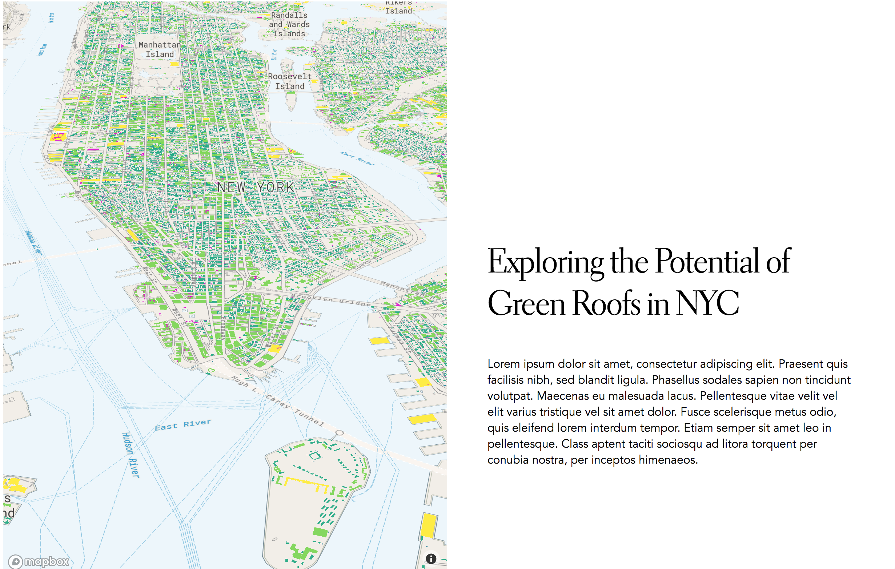
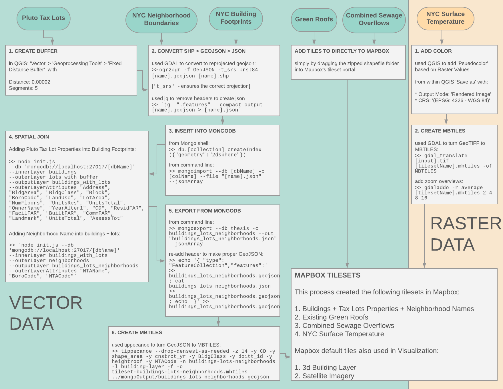

# Envisioning a New Urban Jungle
## Exploring the Potential of Green Roofs in NYC

>> Masters Thesis in Data Visualization from Parsons School of Design, May 2018

### Table of Contents
- [Abstract](#abstract)
- [Data Sources](#data-sources)
- [Data Flow Overview](#data-flow-overview)
- [Resources Used](#resources-used)
- [Methodology](#methodology)
- [Future Directions](#future-directions)
- [Acknowledgements](#acknowledgements)


### Abstract
This thesis explores the ways in which green roofs can be used to counteract three major urban ecological challenges in New York City. Taking the city’s existing infrastructural landscape as the starting point, this thesis moves to identify underutilized spaces where green roofs would be most amenable and beneficial from the perspective of (1) stormwater retention, (2) surface temperature regulation, and (3) biodiversity enhancement. Users will then be given opportunities to explore the data themselves and engage with questions regarding the aggregative effects, and benefits of such interventions. Ultimately the goal of this project is to provide creative ways of interacting with the New York City 'building-scape' in order to foster community engagement and informed decision making for residents and policy-makers alike.

[](https://auchers.github.io/data-visualization-thesis/)

### Data sources
Below is a table summarizing the datasources used in this work as well as where to find them. Further information about data processing specifics can be found [here](https://github.com/auchers/data-visualization-thesis/tree/master/nyc-data-playground).

Data Source | Description
------|------
[PLUTO tax lot database](https://www1.nyc.gov/site/planning/data-maps/open-data/dwn-pluto-mappluto.page) | This dataset details all of the tax lots in the 5 boroughs and details properties such as ‘owner,’ ‘building class’, ‘land class’, ‘address’, etc.
[Building Footprints](https://data.cityofnewyork.us/Housing-Development/Building-Footprints/nqwf-w8eh) | Shapefile of all 1 million+ NYC buildings footprints. Used as main datasource for identifying potential buildings favorable to green roof development.
[Existing Green Roofs](https://github.com/tnc-ny-science/NYC_GreenRoofMapping/tree/master/greenroof_gisdata/20180403_greenroof_gte50px_0x5m/polygons) | This dataset was expertly put together by Michael Treglia at The Nature Conservancy. He was able to use existing datasets, as well as satellite imagery to identify existing green roofs of NYC
[NYC Neighborhood Boundaries](https://www1.nyc.gov/site/planning/data-maps/open-data/dwn-nynta.page) | This dataset contains a list of all Neighborhood Tabulation Areas (NTAs) and their associated geometries. This allowed me to get the neighborhood name for each building.  
[Surface Temperatures](http://urbansystemslab.com/publications/) | This is a raster data set of LANDSAT satellite remote sensors picking up surface temperatures in New York City for an average summer day in 2011. |
[CSO Overflow Count](http://openseweratlas.tumblr.com/) | This data, which originally comes from NYC Department of Environmental Protections, was curated and pulled out of the original pdf reports and into [shapefiles](https://drive.google.com/file/d/1y8sBQiHD6gxS6dx6Civ0_vKXLdVzSNP6/view) by  ‘Open Sewer Atlas NYC.’  It includes the over 450 CSO outfalls, including the annual volume of CSO discharge and number of events per year, from 2006, 2013, 2014, 2015 and 2016 datasets (pulled from the 2014, 2015 and 2016 [NYC DEP reports](http://www.nyc.gov/html/dep/html/harborwater/spdes_bmp_report_2010.shtml)).
Mapbox tilesets - [3D Building Data](https://www.mapbox.com/studio/tilesets/mapbox.mapbox-streets-v7/)  and   [Satellite Imagery](https://www.mapbox.com/studio/tilesets/mapbox.satellite/) | Used directly from Mapbox in order to give context to the work

### Data Flow Overview
More information regarding the step by step process for preparing the data for this project can be found [here](https://github.com/auchers/data-visualization-thesis/tree/master/nyc-data-playground). Below is an overview of the entire data flow drawing from the data sources above.
[](https://github.com/auchers/data-visualization-thesis/blob/master/ThesisDataFlow.png)

#### Resources Used:

* [QGIS](https://qgis.org/en/site/) - open source GIS processing software
* [GDAL](http://www.gdal.org/) - open source command line GIS processing utility
* [JQ](https://shapeshed.com/jq-json/) - command line utility for manipulating jsons
* [Tippecanoe](https://github.com/mapbox/tippecanoe) - utility for converting GeoJSONs into MBTILES to be used in Mapbox
* [Spatial join](https://github.com/UrbanSystemsLab/spatial-join-mongodb) - multi-threaded spatial join developed by the Urban Systems Lab for MongoDB
* [MongoDB](https://docs.mongodb.com/) - database used for geo-spatial queries including spatial join
* [MapboxGL](https://www.mapbox.com/mapbox-gl-js/api/) - JavaScript library that uses WebGL to render interactive maps, also used to hold and serve up map tiles
* [Vue.js](https://vuejs.org/) - open-source JavaScript framework for building user interfaces.
* [Jupyter Notebooks](http://jupyter.org/) - Python interface used to process and analyze data. Feel free to take a look at my rough mid-process analyses [here](https://github.com/auchers/data-visualization-thesis/tree/master/nyc-data-playground/jupyter_notebooks)

### Methodology:

#### Rooftop Eligibility Criteria (adapted from [Ackerman et. al.](http://urbandesignlab.columbia.edu/files/2015/04/4_urban_agriculture_nyc.pdf)):


Criteria | Rationale | Caveats
-------|-------|------
Built 1900-1970 or Industrial Building Class | This is meant to proxy the building’s roof live load capacity -- in other words addresses whether a roof will be able to hold the weight of an intensive green roof. | This is fairly conservative and there are most likely eligible buildings outside of this classification
Building Footprint Area > 10,000 | Meant to determine roofs with available area large enough to justify large investment in an intensive roof. This also on removes many one or two family homes which often have sloped and unsuitable roofs.  | There are many smaller rooftops that would also be able to provide significant benefits.
10 stories tall or lower (translated to <= 200 ‘heightroof’) | Above this, climate conditions become inhospitable for plants and people. It also becomes difficult to transport growth media and equipment.  | For certain benefits such as biodiversity connectivity, lower roofs are better as they allow for easier transference of species. For example, studies have shown that [bees prefer](http://dx.doi.org/10.1080/15659801.2015.1052635) buildings lower than 5 floors

#### Benefit Calculator Formulas

*Surface Temperature* - Drawing from [Hamstead et. al. (2016)](https://www.sciencedirect.com/science/article/pii/S1470160X1500549X)
```sh
1. Current Surface Temp Approximation = (
[sum of lowrise building area] x 33
[sum of midrise building area] x 32
[sum of highrise building area] x 31)
 /  [total building square footage]

2.  Projected Surface Temp Approximation =  (
[sum of lowrise building area] x 33
[sum of midrise building area] x 32
[sum of highrise building area] x 31
[sum of eligible GR area] x 29)
 /  [total building square footage]

Delta = (1) - (2) (for Celsius)
```

*Potential Habitat* - Approximate Roof Vegetation Utilization
```sh
0.75
# Assumption that not all of the roof area will be covered in vegetation
```

*Stormwater Retention* - Taking a conservative estimate of gallons per 1 inch of rainfall from [PlaNYC Stormwater Management Plan (2008)](http://www.nyc.gov/html/planyc/downloads/pdf/publications/nyc_sustainable_stormwater_management_plan_final.pdf) multiplied by the average inches of rainfall in NYC taken from [Central Park Monthly Precipitation](https://www.weather.gov/media/okx/Climate/CentralPark/monthlyannualprecip.pdf) (we took the average of last 10 years)
```sh
Gallons Retained per 1 inch of Rainfall =
[Eligible Square Footage]
* 0.75 [approx efficiency rate]
* 0.47 [gallons per square footage in 1 inch of rainfall]

Gallons Retained Annually =
(formula above)
* 49.6 [average inches of annual rainfall for NYC]
```

### Future Directions
Keep an eye on [projects](https://github.com/auchers/data-visualization-thesis/projects) to see upcoming features and additions. Current thoughts include:

 - [ ] Building more visualizations of building aggregates (histograms, demographics, etc.)
 - [ ] Incorporating more nuance regarding social demographics and vulnerability. Looking at who could most benefit from green roofs


### Acknowledgements
This thesis would not have been possible without the tireless help of Parsons MSDV faculty, specifically Daniel Sauter and Aaron Hill.

This thesis was built and developed in close collaboration with the [Urban Systems Lab](http://urbansystemslab.com/). Very special thanks go out to Timon McPhearson, Jaskirat Randhawa, Rocio Carrero, Rositsa Ilieva, and Jason Mandel.

Additionally, this project wouldn't be half of what it is without the support, encouragement, and inspiration from the rest of the 2018 MSDV cohort -- check out their amazing(!) work [here](http://visualizedata.github.io/thesis/).
