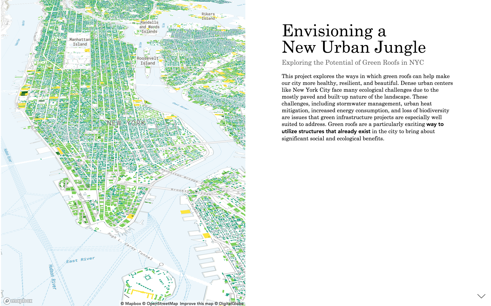

# msdv-thesis

> [WORK IN PROGRESS] thesis for M.Sc. in Data Visualization from Parson School of Design

# Exploring the Potential of Green Roofs in NYC
## Abstract
This thesis explores the ways in which green roofs can be used to counteract three major urban ecological challenges in New York City. Taking the city’s existing infrastructural landscape as the starting point, this thesis moves to identify underutilized spaces where green roofs would be most amenable and beneficial from the perspective of (1) stormwater retention, (2) surface temperature regulation, and (3) biodiversity enhancement. Users will then be given opportunities to explore the data themselves and engage with questions regarding the aggregative effects, benefits, and costs of such interventions. Ultimately the goal of this project is to provide creative ways of interacting with the New York City 'building-scape' in order to foster community engagement and informed decision making for residents and policy-makers alike.

