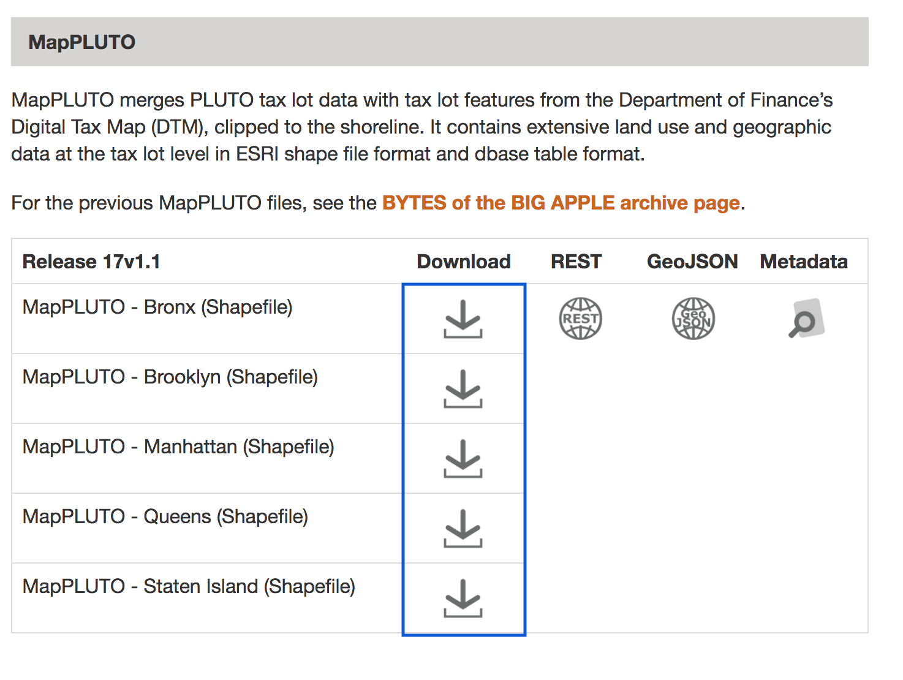
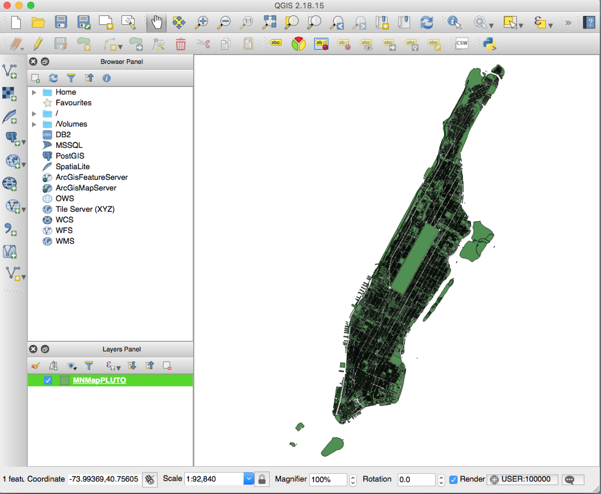
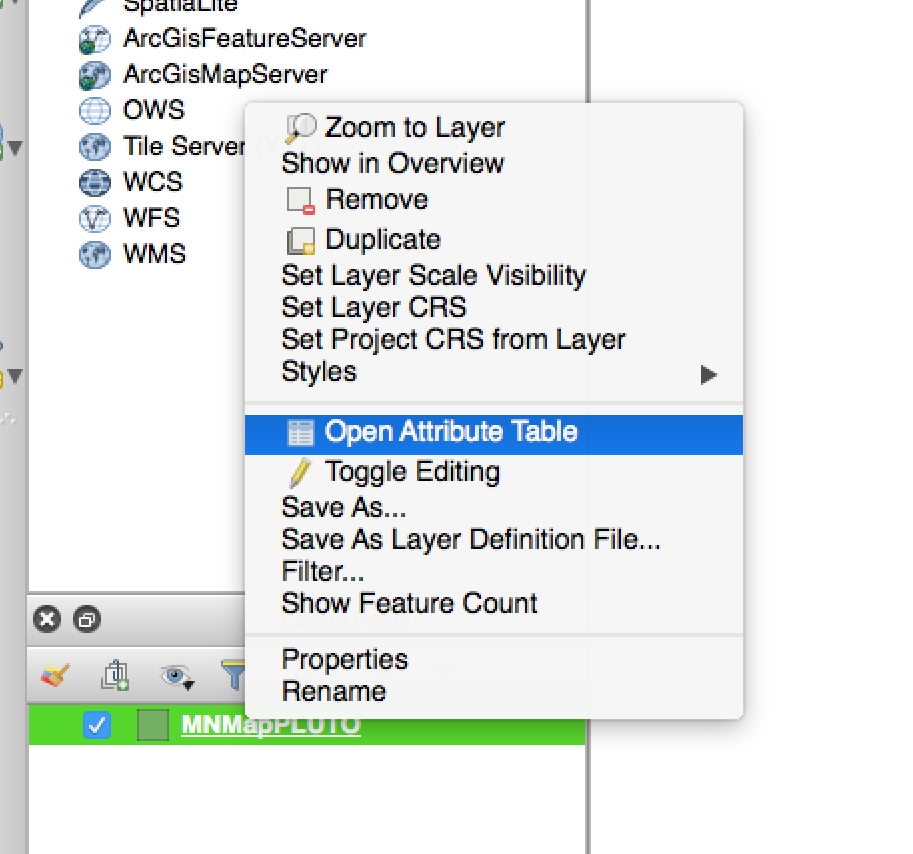

# Documentation for Data Processing

## Step 1: Accessing Data

The first step was to download the data. In this case I used publicly available New York City tax lot data available [here](https://www1.nyc.gov/site/planning/data-maps/open-data/dwn-pluto-mappluto.page). This data comes in the form of **shapefiles**. I downloaded all 5 boroughs (from the bottom of the page) and unzipped them.



#### (Optional) Exploration 

In order to get a better sense regarding what I was dealing with, I used [QGIS](https://www.qgis.org/en/site/) to quickly get a sense of what I had to work with. QGIS is open-source geographic modelling software that you can download to your computer and then view/augment various geographic file formats. 

Once you download the software you can simply drag one of the '.shp' files into the layers panel and you will be able to view the map.


To explore what information comes within these files, you can peek in the 'attribute table' and there you will find all the properties this dataset returns. More information about these fields can be found in PlUTO's [documentation](https://www1.nyc.gov/assets/planning/download/pdf/data-maps/open-data/pluto_datadictionary.pdf?v=17v1_1)

 

## Step 2: Convert to GeoJSON

Shapefiles are great because they are super great at holding a lot of information without taking up a lot of space.
`TODO: add more info about shapefiles here`

That said, aside from specific GIS software like QGIS and ArcGIS, very few programs can handle their structure. That's why we will now be converting these files to geoJSON. Once they are in that format, they are like regular JSON objects and we can do anything with them. 

Luckily there is a really great piece of software called [`ogr2ogr`](http://www.gdal.org/ogr2ogr.html) that can make this conversion easy for us. I followed along with [this procedure](https://ben.balter.com/2013/06/26/how-to-convert-shapefiles-to-geojson-for-use-on-github/).

   * First, install [gdal](http://www.gdal.org/). This is actually the software underlying QGIS which we used earlier. 
   
   ```brew install gdal```
   
   * Next, `cd` into your directory with the shapefile and run
   
   ```ogr2ogr -f GeoJSON -t_srs crs:84 [name].geojson [name].shp```
   
The `-t_src` is critical here as this is what projects our geospatial points into ones that can be recognized by other programs. The value we are passing it (`crs:84`). There are many different projections one can use, but I have always been safest with this one [**WGS 84: EPSG Projection**]. You can read a bit about it [here](http://mapserver.org/ogc/wms_server.html#coordinate-systems-and-axis-orientation).

(optional note): I liked to keep my shapefiles and geoJSON separate so that I could keep track of where all my data was coming from. 

```$xslt
.
+-- data
|   +-- shapefiles
|        +-- qn_mappluto_17v1_1
|        +-- mn_mappluto_17v1_1
|        +-- bk_mappluto_17v1_1
|        +-- Bronx17V1.1
|        +-- StatenIsland17V1.1
|   +--geoJSON

```
## Step 3: Load into MongoDB for easier analysis and querying

```$xslt
 jq  ".features" --compact-output output.geojson > features.json
 mongoimport --db databaseName -c features --file "features.json" --jsonArray
```
