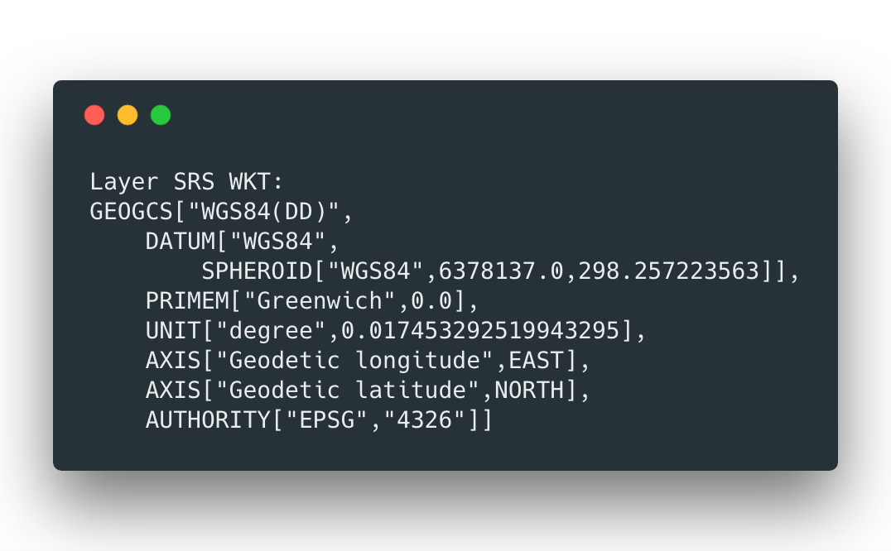
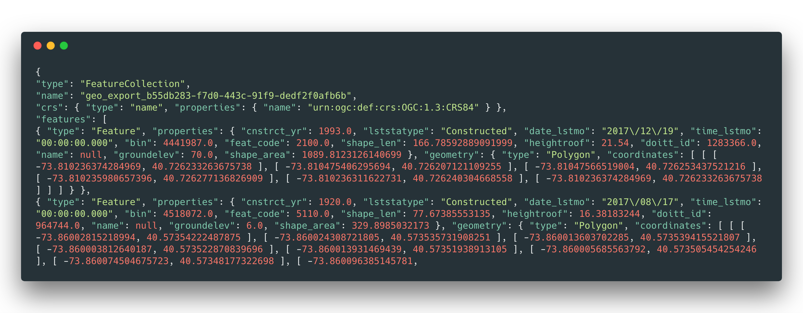
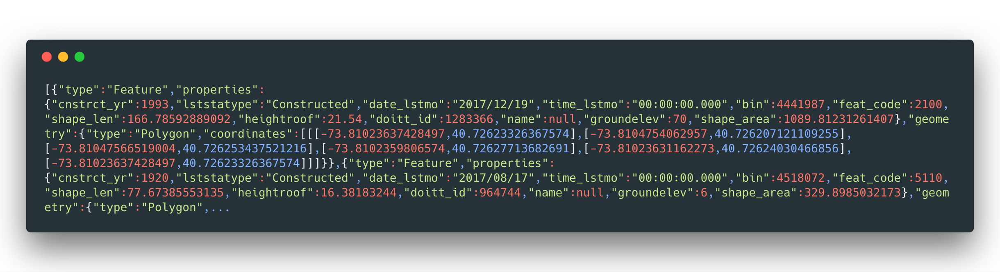

*Data Documentation*

Ultimately creates 1 NYC buildings dataset composed of the following 3 parts:

Spatial Join documentation from [here](https://github.com/UrbanSystemsLab/spatial-join-mongodb)

1. [PLUTO Tax Lots](https://www1.nyc.gov/site/planning/data-maps/open-data/dwn-pluto-mappluto.page), with buffer
2. [NYC Building Footprints](https://data.cityofnewyork.us/Housing-Development/Building-Footprints/nqwf-w8eh)
3. [Green Roofs](https://github.com/tnc-ny-science/NYC_GreenRoofMapping/tree/master/greenroof_gisdata/20180403_greenroof_gte50px_0x5m/polygons)
4. [NYC Neighborhood Boundaries](https://www1.nyc.gov/site/planning/data-maps/open-data/dwn-nynta.page)

# Data Preprocessing

## Step 1: Create buffer on PLUTO dataset
(If you want all 5 boroughs, a pre-step would be to merge the shapefiles of all 5 boroughs into 1 file and re-project that 1 file) [ref](https://www.northrivergeographic.com/ogr2ogr-merge-shapefiles))

This is important so that our spatial join will be able to catch the buildings as being within each lot
In QGIS - 'Vector' > 'Geoprocessing Tools' > 'Fixed Distance Buffer' with
* 'Distance': 0.00002 and
* 'Segments': 5

## Step 2: Add all three to MongoDB

### Convert Shapefiles to GeoJSON (ensuring correct projection)
In order to load these datesets into MongoDB, we have to first convert them into JSON files. We can do that using GDAL's 'Ogr2ogr' utility by running:

> `ogr2ogr -f GeoJSON -t_srs crs:84 [name].geojson [name].shp`

We are also taking this opportunity to make sure that we are using the correct projection by using the -t_srs flag. This is critical for our spatial join to work as expected, as well as for mapboxGL to render our maps at the end of this process.

We can always check that our files are in the  **correct projection (WGS84)** by running the following (taken from [this SO question](this question)):

> `ogrinfo -ro -so -al  file.shp`  
> #`-ro` opens the file in read only mode
> #`-so` 'summary only' - suppresses all of the features and shows only summary info
> #`al` lists all the layers in the given file

Given the correct projection, it should look like this:

### Remove Headers to Create JSON files
At this point, we need to augment our file a bit to make sure that each feature in this collection gets added to MongoDB as its own document. To do that we need to strip off the header, and load into MongoDB only the 'features' section.

You can see the problem by viewing the beginning of one of the files with something like `less` (to get out of that screen, just type `q`).

example:
> `less buildings.geojson`

(we only want the part contained in 'features')

To get just the 'features' we can use `jq` utility ([helpful link](https://shapeshed.com/jq-json/#how-to-use-pipes-with-jq)) by running:

> `jq  ".features" --compact-output buildings.geojson > buildings.json`

> `jq  ".features" --compact-output green_roofs.geojson > green_roofs.json`

> `jq  ".features" --compact-output lots_with_buffer.geojson > lots_with_buffer.json`

> `jq ".features" --compact-output neighborhoods.geojson >neighborhoods.json`

now when we run `less buildings.json` we should see:
 (see? only section within 'features' with no header)

Now these are ready to load into MongoDB!

### Database Information

To get MongoDB running, run `mongod`. Then, in a separate terminal window run `mondo` to get the mongo shell.

### Ensuring Spatial Index

Create empty collections in MongoDB before importing the data (from the mongo shell)

> `db.buildings.createIndex({"geometry":"2dsphere"})
db.lots_with_buffer.createIndex({"geometry":"2dsphere"})
db.green_roofs.createIndex({"geometry":"2dsphere"})
db.neighborhoods.createIndex({"geometry":"2dsphere"})`
`

Import json files into mongo collections (from regular terminal window located in the directory holding your json files)

> `mongoimport --db thesis -c buildings --file "buildings.json" --jsonArray
mongoimport --db thesis -c lots_with_buffer --file "lots_buffer.json" --jsonArray
mongoimport --db thesis -c green_roofs --file "green_roofs.json" --jsonArray
mongoimport --db thesis -c neighborhoods --file "neighborhoods.json" --jsonArray`

We can compare the documents loaded to the original file by checking:

>`jq '. | length' test_file.json`

against
> `db.[col].find().count()` # from Mongo shell

For me the total counts looked like this:

Dataset | JSON length | collection count
-----|-----|-----
Buildings | 1082792 | 1082789
Lots with Buffer | 857266 | 857266
Green Roofs | 7130 | 3659   (many were lost here due to bad spatial index)

TODO: check what happened with green roofs loss

To double check, let's ensure the spatial index:
> `db.buildings.ensureIndex({"geometry":"2dsphere"})
db.lots_with_buffer.ensureIndex({"geometry":"2dsphere"})
db.green_roofs.ensureIndex({"geometry":"2dsphere"})`

### Database schema
DB name: 'thesis'

**Collections**:

Collection Name | Data
----- |-----|-----
buildings | NYC building Footprints
lots_with_buffers | PLUTO lots with buffers (from step 1)
green_roofs | GreenRoofs
neighborhoods | Neighborhood vector files
buildings_with_lots | spatial join of 'buildings' with 'lots_with_buffers'
buildings_lots_neighborhoods | spatial join of 'buildings_with_lots' and 'neighborhoods'

### Add Green Roof Column to Green Roof Data

Once we join the data, we'll want some field by which to filter out the green roofs for the future views. This is the best time to add that in so that we can keep track of which of our geometries are, in fact, green roofs.

To view the existing properties of our Green Roof dataset, we can run:

>`db.green_roofs.find({},{"properties": 1}).limit(10)`

To add our new field to the whole collection, we'll run:

>`db.green_roofs.update({}, {$set : {"properties.green_roof": 1}}, false, true)`

Now when we check `db.green_roofs.find({},{"properties": 1}).limit(10)` again, we should see our new field there.

## Step 3: First Spatial Join (Lot properties into Buildings)
For this project, we will be using the multi-threaded spatial join brilliantly developed [here](https://github.com/UrbanSystemsLab/spatial-join-mongodb). This join is attempting to bring information from PLUTO into our building footprint polygons. PLUTO holds many of the interesting building specific features such as information about the owner, the district, the land use class, and building class.

To view the fields we have in our PLUTO lots data we can run:

>`db.lots_with_buffer.find({},{"properties": 1}).limit(10).pretty()`

Fields from PLUTO lots to merge into Buildings:

> `node init.js --db 'mongodb://localhost:27017/thesis' --innerLayer buildings --outerLayer lots_with_buffer --outputLayer buildings_with_lots  --outerLayerAttributes "Address", "BldgArea", "BldgClass", "Block", "BoroCode", "LandUse", "LotArea", "NumFloors", "UnitsRes", "UnitsTotal", "OwnerName", "YearAlter1", "CD", "ResidFAR", "FacilFAR", "BuiltFAR", "CommFAR", "Landmark", "UnitsTotal", "AssessTot" `

## Step 4: Second Spatial Join (Neighborhood Name into Buildings_With_Lots)
Unfortunately, PLUTO does not provide information on the neighborhood name of a given building. This makes sense because neighborhoods are relatively fluid and dynamic conceptual entities that perhaps do not belong in a tax lot database.

However, for this thesis, I really wanted to give users the opportunity to filter by their own neighborhood. To do that I needed some, even if imperfect mapping from building location to neighborhood name. I ended up finding a [Neighborhood Boundary](https://www1.nyc.gov/site/planning/data-maps/open-data/dwn-nynta.page) shapefile as part of NYC open data portal.

Therefore, I took our most recently joined collection, `buildings_with_lots` and joined into it the neighborhood name. This probably is not perfect, but it at least maps some neighborhood name to the buildings so that we have some way of sorting.

<`node init.js --db 'mongodb://localhost:27017/thesis' --innerLayer buildings_with_lots --outerLayer neighborhoods --outputLayer buildings_lots_neighborhoods --outerLayerAttributes "NTAName", "BoroCode", "NTACode"`

## Step 5: Export from MongoDB
In order to get this data back into tileset form, we need to export it from mongoDB and ultimately convert it into MBTILES that we can load into Mapbox to later serve onto our final map. The first step is to export this newly joined data as a json file.

>`mongoexport --db thesis -c buildings_lots_neighborhoods --out "buildings_lots_neighborhoods.json" --jsonArray`

Re-add the header to make the file a valid GeoJSON:

>`echo '{ "type": "FeatureCollection","features":'  >> buildings_lots_neighborhoods.geojson ; cat  buildings_lots_neighborhoods.json >> buildings_lots_neighborhoods.geojson ; echo '}' >> buildings_lots_neighborhoods.geojson`

## Step 6: Convert to MBTILES
Our final step is to convert our geojson file into a format that mapbox can treat as a map layer. The best way to do this is using [tippecanoe](https://github.com/mapbox/tippecanoe), which offers many options for how to convert a vector tileset to MBTILES.

The main issue with this type of data is that it is above the size that mapbox is willing to serve. Therefore, depending on the zoom level (and how much detail is within view) tippecanoe knows to drop the features that are least relevant. They do have a few options depending on what your priorities are.

`--drop-fraction-as-needed` vs `-pd`

`-pd` creates really uneaven coverage at zoom levels lower than 14 (as in more zoomed out)

`--drop-fraction-as-needed` looks like more even coverage, but when you zoom in it is missing features

I ultimately went with using the `-y` flag to specify the fields that I wanted in conjunction with `--drop-fraction-as-needed` because I didn't want to miss any buildings.

> `tippecanoe --drop-densest-as-needed -z 14 -y CD -y shape_area -y BldgClass -y doitt_id -y heightroof -y LandUse -y NTACode -n buildings-lots-neighborhoods -l building-layer -f -o tileset-buildings-lots-neighborhoods.mbtiles ../mongoOutput/buildings_lots_neighborhoods.geojson`
